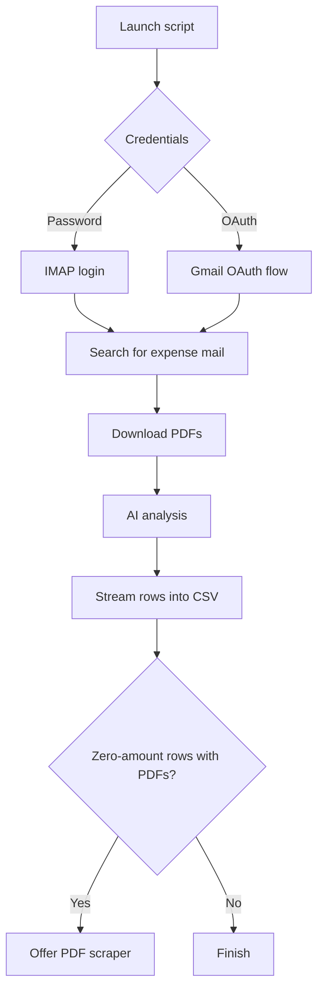

# Email Expense Collector

Automate the boring parts of expensing: this toolkit signs into your mailbox, fetches receipts, extracts structured information with AI, and patches up missing totals from PDFs.

## 🧭 What's in the box?

| Script | Purpose |
| --- | --- |
| `expense_launcher.py` | Friendly entry point that creates `.env`, runs the collector, and offers to fix zero-amount rows with the PDF scraper. |
| `collect_expenses.py` | Talks to IMAP (password or Gmail OAuth), downloads attachments, sends emails through the AI analyzer, and streams rows into `expenses_<year>.csv`. |
| `pdf_amount_scraper.py` | Revisits rows where the amount is missing but a PDF exists and asks the AI to read the invoice. |
| `email_backup.py` | Bulk-export raw `.eml` files from selected folders. |
| `retrieve_conversation.py` | Pull an entire thread for a specific sender and save it as markdown. |
| `mcp_email_server.py` | [MCP](https://modelcontextprotocol.io/) server exposing email tools for AI assistants (search, read, send, retrieve conversations, read PDFs). |
| `merge_conversations.py` | Merge multiple conversation markdown exports into a single deduplicated, chronological file. |

The heavy lifting lives in `ai_expense_analyzer.py`, which supports Anthropic Claude and OpenAI models, and `oauth_client.py` / `oauth_microsoft.py` for Gmail and Microsoft OAuth flows.

## 🚀 Quickstart

1. **Install prerequisites**
   - Python 3.10+
   - [uv](https://docs.astral.sh/uv/) for dependency management (install once with `pip install uv`)

2. **Install project dependencies**

   ```powershell
   uv sync
   ```

   This creates a virtual environment under `.venv` and installs everything from `pyproject.toml`.

3. **Launch the guided setup**

   ```powershell
   uv run expense-launcher
   ```

   The launcher will:
   - Collect your OpenAI key (required) and optional Anthropic / Gmail app password
   - Generate a `.env` file beside the scripts
   - Ask which year to process
   - Walk through IMAP password or Gmail OAuth sign-in
   - Run the collector and, afterwards, offer to fill zero-amount rows via the PDF scraper

Need to re-run without setup? `uv run collect-expenses` (or `python collect_expenses.py`) starts the collector directly.

## 🛠 Configuration & Environment

- Copy `.env.example` to `.env` if you want to edit values manually.
- Supported keys:
  - `OPENAI_API_KEY` (required for current flow)
  - `ANTHROPIC_API_KEY` (optional alternative provider)
  - `AI_PROVIDER` (`openai` or `anthropic`; defaults to `openai`)
  - `GOOGLE_APP_PASSWORD` (optional Gmail app password - [create one](https://myaccount.google.com/apppasswords))
  - `MICROSOFT_APP_PASSWORD` (optional Outlook/Hotmail app password - [create one](https://account.live.com/proofs/manage))
  - `MICROSOFT_OAUTH_CLIENT_ID` (optional for Microsoft OAuth)
- The collector automatically prefers whichever provider has a key in `.env`; you can still override choices interactively.
- Gmail OAuth stores refresh tokens in `%USERPROFILE%\.email-backup\` so you only authorise once per account. Place `client_secret.json` in the project root (already ignored by git) or point `GOOGLE_OAUTH_CLIENT_SECRETS` to your downloaded file.

## 📬 Running the collectors

### Expense collection workflow



Outputs land in `expenses_<year>/`:

```
expenses_2025/
├── expenses_2025.csv      # Structured data
├── attachments/           # Saved PDFs
└── expense_collector.log  # Detailed run log
```

### PDF amount scraper

Run on-demand when you're missing totals:

```powershell
uv run python pdf_amount_scraper.py
```

It scans the latest CSV, finds rows with `amount == 0` and PDF attachments, asks the configured AI to read the invoice, then updates the CSV in place (with a backup of the original).

### Optional utilities

- `uv run python email_backup.py` exports whole folders to `mail_export/`.
- `uv run python retrieve_conversation.py` fetches all messages to/from a contact and writes `conversation_<email>.md`.
- `uv run python merge_conversations.py <file1> <file2> ...` merges multiple conversation exports into one deduplicated file.

### MCP email server

The MCP server lets AI assistants (e.g. GitHub Copilot, Claude Desktop) interact with your mailbox directly. Start it with:

```powershell
uv run python mcp_email_server.py
```

Or configure it in your editor's MCP settings. Exposed tools:

| Tool | Description |
| --- | --- |
| `list_folders` | List all IMAP mailbox folders |
| `search_emails` | Search emails by sender, subject, date range, folder |
| `get_email_by_uid` | Read a specific email by UID |
| `retrieve_conversation` | Export full conversation with a contact as markdown |
| `list_conversation_attachments` | List attachments from a saved conversation |
| `download_email_attachment` | Download a specific attachment from an email |
| `read_email_attachment_pdf` | Read PDF attachment content directly from an email |
| `read_pdf` | Extract text from a local PDF file |
| `convert_pdf_to_markdown` | Convert a PDF to markdown |
| `send_email` | Send an email via SMTP with OAuth |
| `draft_reply` | Draft a reply to an existing email |

## 🔐 Authentication options

| Option | When to use | Notes |
| --- | --- | --- |
| IMAP password | Works with most providers | Gmail requires an [App Password](https://myaccount.google.com/apppasswords). Microsoft accounts may need an [App Password](https://account.live.com/proofs/manage). Prompted securely each run. |
| Gmail OAuth | No app password needed | Install `google-auth` / `google-auth-oauthlib` (already included). Place `client_secret.json` in the project root; tokens cached in `%USERPROFILE%\.email-backup`. |
| Microsoft OAuth | Outlook/Hotmail/Live/Office365 | Install `msal` (already included). Register an app in [Azure Portal](https://portal.azure.com/#blade/Microsoft_AAD_RegisteredApps/ApplicationsListBlade), add `IMAP.AccessAsUser.All` permission, set `MICROSOFT_OAUTH_CLIENT_ID` in `.env`; tokens cached in `%USERPROFILE%\.email-backup`. |

The collector auto-detects the appropriate OAuth provider based on your email domain.

### Setting up Microsoft OAuth

1. Go to [Azure App Registrations](https://portal.azure.com/#blade/Microsoft_AAD_RegisteredApps/ApplicationsListBlade)
2. Click "New registration"
3. Choose "Personal Microsoft accounts only" or "Accounts in any organizational directory and personal Microsoft accounts"
4. Add "Mobile and desktop applications" platform with redirect URI: `http://localhost`
5. Under "API permissions", add `IMAP.AccessAsUser.All` (Office 365 Exchange Online)
6. Copy the Application (client) ID and set it in `.env` as `MICROSOFT_OAUTH_CLIENT_ID`
7. Run the collector and choose OAuth; it will launch a browser for device code authentication

## 🤖 AI provider details

- Default provider comes from `AI_PROVIDER`; the launcher auto-selects the provider whose key is present.
- OpenAI usage is summarised at the end of each run (tokens + estimated cost for supported models).
- AI safeguards normalise amounts, vendors, currencies, and refuse suspicious outputs.
- For Anthropic support you'll need the `anthropic` Python package (installed via `uv sync`).

## 🧪 CSV schema cheatsheet

| Column | Meaning |
| --- | --- |
| `date` | Email date stamp |
| `subject`, `from` | Message metadata |
| `vendor`, `amount`, `currency`, `category`, `description` | AI-extracted fields |
| `confidence` | Normalised confidence (max 0.2 unless attachments were used) |
| `has_attachments`, `attachment_files` | Attachment presence and filenames |
| `folder` | Source mailbox folder |

The collector writes incrementally to minimise data loss if interrupted.

## 🩺 Troubleshooting

- **OAuth keeps opening a browser**: delete cached tokens in `%USERPROFILE%\.email-backup` and retry.
- **Collector cannot find client secret**: ensure `client_secret.json` lives beside the scripts or set `GOOGLE_OAUTH_CLIENT_SECRETS` to an absolute path.
- **No AI key detected**: confirm `.env` exists, or rerun the launcher to regenerate it.
- **PDF scraper skipped rows**: check `pdf_amount_scraper.log` inside the expenses folder for errors (missing PDFs, unreadable files, etc.).
- **Dependency issues**: rerun `uv sync`; uv will recreate the `.venv` with all required packages.

## 📄 License

MIT License. Do whatever helps you tame your inbox—pull requests welcome!
